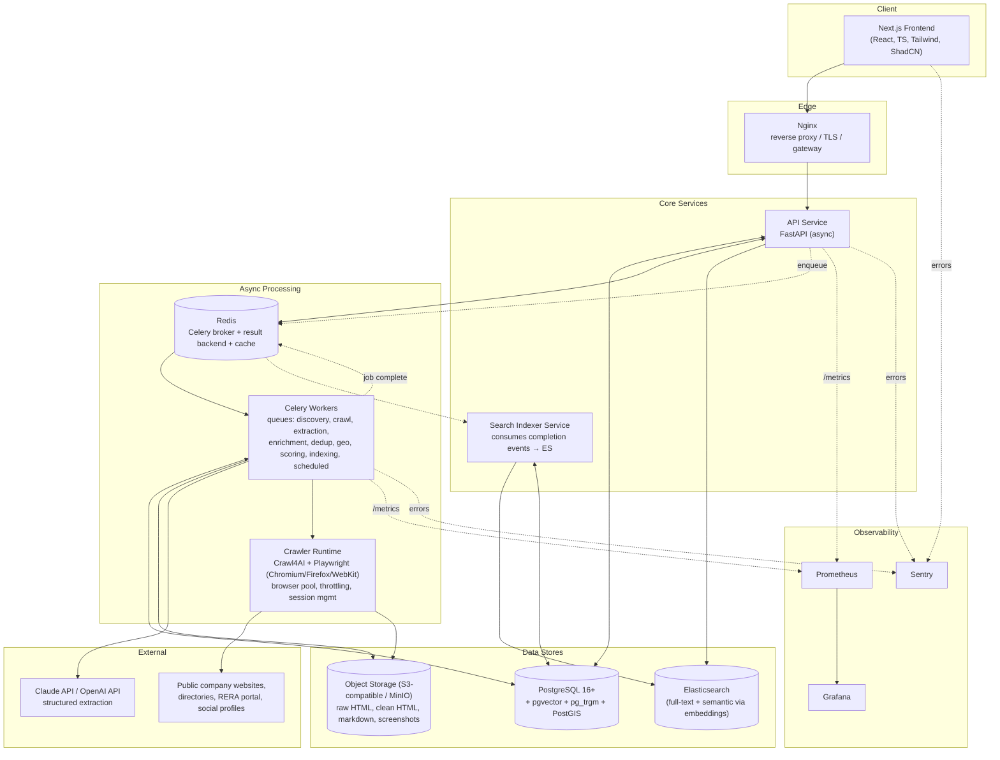
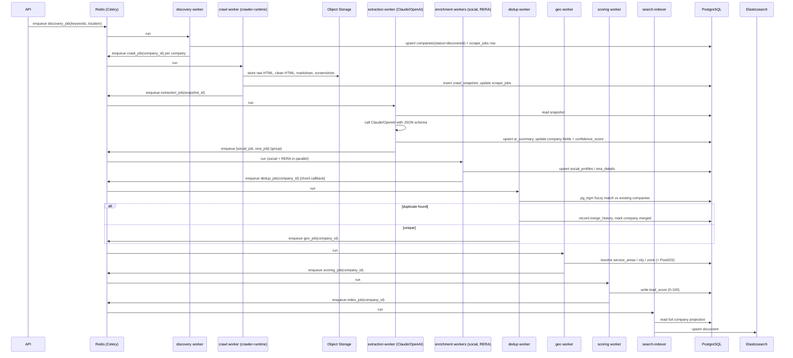

# Module 1 — Architecture

**Project:** India Real Estate Intelligence Platform (Pune-first, India-wide expansion)
**Status:** Design only — no implementation in this module.
**Scope:** High-level architecture, folder structure, services, communication/event flow, database strategy, deployment strategy.

---

## 1. Guiding Constraints

- Only publicly available business information is collected; every crawler/discovery component must respect `robots.txt`, site Terms of Service, and rate limits.
- Must run comfortably as a **single-region, Pune-only** deployment today and scale horizontally to an **all-India** deployment without a rewrite.
- Crawling is the most resource-intensive, most rate-limited, and most failure-prone subsystem — it must be isolated so it cannot starve or take down enrichment, API, or search.
- Every job (discovery, crawl, extraction, enrichment, dedup, scoring, indexing) must be **idempotent and resumable**, tracked in a `scrape_jobs` ledger.
- Approved stack only (see master prompt). No infrastructure is introduced that isn't in that list (e.g. no Kafka/K8s in v1 — see §8 Open Recommendations for when to revisit).

---

## 2. High-Level Architecture



### Service inventory

| Service | Responsibility | Approved tech |
|---|---|---|
| **web** | UI: search, company profiles, maps, exports, admin, auth | Next.js, React, TS, Tailwind, ShadCN, TanStack Table, React Query, MapLibre/Leaflet, ECharts |
| **api** | Public/internal REST API, auth/RBAC, orchestrates job submission, serves search & CRUD | FastAPI, SQLAlchemy (async), Pydantic, JWT |
| **worker** | All background processing: discovery, crawl orchestration, AI extraction, enrichment (social/RERA), dedup, geo, scoring, scheduled refresh | Celery, Redis broker |
| **crawler-runtime** | Isolated browser-automation execution used by `crawl` queue workers | Crawl4AI, Playwright, BeautifulSoup4/lxml/selectolax, trafilatura, readability-lxml, markdownify |
| **search-indexer** | Projects Postgres state into Elasticsearch documents on job completion / change events | Elasticsearch client, SQLAlchemy |
| **postgres** | System of record | PostgreSQL + pgvector + pg_trgm + PostGIS |
| **redis** | Celery broker/result backend, API cache, rate-limit counters | Redis |
| **elasticsearch** | Search & filtering, semantic search via stored embeddings | Elasticsearch (Meilisearch pluggable alternative, see §8) |
| **object storage** | Large artifacts: raw HTML, clean HTML, markdown, screenshots | S3-compatible (MinIO in dev, S3 in prod) |
| **nginx** | TLS termination, reverse proxy, static asset serving | Nginx |
| **observability** | Metrics, dashboards, error tracking | Prometheus, Grafana, Sentry |

**Why `crawler-runtime` is its own logical service, not just "a Celery task":** Playwright browser processes are heavy (memory, CPU, zombie-process risk) and must be pooled and rate-limited per-domain independently of everything else. It is deployed as its own container image/worker pool, consumed by the `crawl` Celery queue with a small, fixed concurrency, so a browser leak or a slow site can never block extraction/enrichment/API queues. In v1 it can run inside the same repo/image family as `worker` (shared queue-consumer entrypoint, different queue+concurrency config); the separation is a deployment boundary, not necessarily a separate codebase.

---

## 3. Monorepo Folder Structure

```
punerecpip/
├── apps/
│   ├── api/                          # FastAPI backend
│   │   ├── src/api/
│   │   │   ├── main.py
│   │   │   ├── core/                 # config, security, logging, db session, celery client
│   │   │   ├── v1/                   # routers: companies, contacts, search, jobs, auth, exports, admin
│   │   │   ├── services/             # business logic (orchestration, not DB access)
│   │   │   ├── repositories/         # SQLAlchemy query layer
│   │   │   └── deps.py               # FastAPI dependencies (auth, db session, pagination)
│   │   ├── alembic/                  # migrations (owns the schema; see §5)
│   │   ├── tests/{unit,integration}/
│   │   ├── Dockerfile
│   │   └── pyproject.toml
│   │
│   ├── worker/                       # Celery workers
│   │   ├── src/worker/
│   │   │   ├── celery_app.py         # queue definitions, routing, retry/backoff policy
│   │   │   ├── tasks/
│   │   │   │   ├── discovery/
│   │   │   │   ├── crawling/
│   │   │   │   ├── extraction/       # AI structured extraction
│   │   │   │   ├── enrichment/       # social, RERA
│   │   │   │   ├── dedup/
│   │   │   │   ├── geo/
│   │   │   │   ├── scoring/
│   │   │   │   └── scheduling/       # periodic refresh, change detection
│   │   │   └── config.py
│   │   ├── tests/{unit,integration}/
│   │   ├── Dockerfile
│   │   └── pyproject.toml
│   │
│   ├── crawler-runtime/              # Crawl4AI/Playwright execution layer, imported by worker's crawling tasks
│   │   ├── src/crawler_runtime/
│   │   │   ├── browser_pool.py
│   │   │   ├── fetchers/             # crawl4ai_client, scrapy fallback
│   │   │   ├── extractors/           # trafilatura/readability/markdownify wrappers
│   │   │   └── throttling.py         # per-domain rate limits, robots.txt compliance
│   │   ├── tests/
│   │   └── pyproject.toml
│   │
│   ├── search-indexer/               # ES projection service
│   │   ├── src/search_indexer/
│   │   │   ├── listener.py           # consumes "company changed" jobs
│   │   │   ├── mappings/             # ES index mappings/settings
│   │   │   └── projector.py          # Postgres row -> ES document
│   │   ├── tests/
│   │   └── pyproject.toml
│   │
│   └── web/                          # Next.js frontend
│       ├── src/{app,components,lib,hooks,types}/
│       ├── tests/
│       └── package.json
│
├── packages/
│   └── core/                         # shared Python package (uv workspace member)
│       ├── src/corelib/
│       │   ├── models/               # SQLAlchemy ORM models — single source of truth for schema
│       │   ├── schemas/              # Pydantic schemas (AI extraction JSON schema lives here too)
│       │   ├── enums/                # BusinessCategory, PropertyType, JobStatus, Role, etc.
│       │   └── utils/                # logging, retry, geo helpers, fuzzy-match helpers
│       └── pyproject.toml
│
├── infra/
│   ├── docker/                       # per-service Dockerfiles if not colocated
│   ├── docker-compose.yml            # prod-like full stack
│   ├── docker-compose.dev.yml        # dev overrides (hot reload, exposed ports, MinIO console)
│   ├── nginx/
│   ├── prometheus/
│   └── grafana/
│
├── .github/workflows/                # ci.yml, deploy.yml
├── docs/
│   ├── architecture/                 # this document, updated per module
│   ├── modules/                      # one doc per module as built
│   └── adr/                          # architecture decision records
├── pyproject.toml                    # uv workspace root
└── README.md
```

**Why a monorepo with a shared `packages/core`:** `api` and `worker` both read/write the same tables. Duplicating SQLAlchemy models between two services guarantees drift. A shared, versioned internal package (installed via `uv` workspace, not published externally) keeps models/schemas/enums single-sourced. Alembic migrations live under `apps/api` (API is the schema owner) but operate on models imported from `packages/core`.

---

## 4. Communication & Event Flow

### 4.1 Synchronous paths
- `web` → `api`: REST over HTTPS, OpenAPI-documented, JWT bearer auth.
- `api` → `postgres`: async SQLAlchemy, connection-pooled.
- `api` → `elasticsearch`: read-only, for search/filter/autocomplete endpoints.
- `api` → `redis`: cache reads, rate-limit counters, Celery task submission (`apply_async`).

### 4.2 Asynchronous pipeline (Celery canvas, not a message bus)

The approved stack is Celery + Redis — no Kafka/RabbitMQ. Pipeline stages are modeled as **Celery chains/chords** with each stage writing its own durable checkpoint to `scrape_jobs`, so the pipeline is resumable from Postgres state even if Redis/Celery state is lost.



- Every arrow into `PG` is also an insert into `change_history` / `scrape_jobs` / `logs` (audit + resumability — see Module 2 for exact tables).
- Retries: each Celery task uses bounded exponential backoff (`autoretry_for`, `max_retries`, `retry_backoff=True`), and failures land the `scrape_jobs` row in `failed` with the error payload rather than silently dropping.
- Real-time job-status updates to the UI (optional, not required for v1): Postgres `LISTEN/NOTIFY` on `scrape_jobs` → a lightweight API-side listener → Server-Sent Events to the frontend. Flagged as an enhancement in §8, not required for Module 1.

### 4.3 Scheduled automation (Module 12, flagged now for architecture)
Celery beat drives periodic tasks: re-discovery, website refresh (staleness-based, not blanket re-crawl), RERA re-sync, scheduled AI-enrichment refresh, and change detection (diff against last snapshot, write to `change_history`). Beat schedule config lives in `apps/worker/src/worker/celery_app.py`, backed by `redbeat` semantics (Redis-backed beat scheduler) so schedule state survives restarts — no new infra beyond Redis.

---

## 5. Database Strategy

- **Single PostgreSQL 16+ instance** (managed or self-hosted) is the system of record for all structured data. Full schema is designed in Module 2; this module fixes the *strategy*:
  - `public` schema is sufficient for v1 (single-tenant, Pune-first). Revisit schema-per-region only if multi-tenancy is required later — not indicated by requirements.
  - Extensions enabled at migration 0001: `pgvector` (embeddings for semantic search & AI-assisted dedup), `pg_trgm` (fuzzy matching for discovery/dedup), `postgis` (service-area polygons, distance queries) `citext` (case-insensitive email/domain matching).
  - **Large artifacts (raw HTML, clean HTML, screenshots) are never stored as bytea in Postgres** — only object-storage keys/URLs + checksums + size are stored in `crawl_snapshots`. Markdown and structured JSON extraction (small, queryable) may be stored directly as `text`/`jsonb`.
  - Alembic owns all schema change (`apps/api/alembic`), one linear migration history, run automatically on deploy (init container / entrypoint step) before API/worker start.
  - Every mutable entity gets `created_at`, `updated_at`, `created_by`/`updated_by` (nullable, system jobs vs users), and a corresponding `change_history` row on update — append-only audit trail, independent from Postgres's own WAL.
- **Redis** is not a system of record — safe to flush; Celery broker + result backend + short-TTL API cache + rate-limit counters only.
- **Elasticsearch** is a derived read model, always rebuildable from Postgres via `search-indexer` (full reindex job + incremental upserts on change). Never a source of truth.

---

## 6. Deployment Strategy

### Environments
- **Dev:** `docker-compose.yml` + `docker-compose.dev.yml` — full stack including MinIO (S3-compatible), hot-reload volumes, exposed ports for direct DB/Redis/ES access.
- **Staging/Prod (v1, Pune scale):** same Compose-based images, run on a single host or small host group, Nginx in front, `.env`-driven secrets injected at deploy time (never committed — `.env.example` only). This matches the approved DevOps stack (Docker, Docker Compose, GitHub Actions, Nginx) without introducing Kubernetes, which is out of scope until nationwide scale requires it (see §8).

### CI/CD (GitHub Actions)
1. **`ci.yml`** on PR: lint (ruff/eslint), type-check (mypy/pyright, tsc), unit + integration tests per app, `docker build` for every service to catch build breaks.
2. **`deploy.yml`** on merge to main (or tag): build & push images to registry, SSH/compose-based rolling redeploy, run Alembic migrations as a pre-deploy step, smoke-test health endpoints, report to Sentry release tracking.
3. Each `apps/*` service is built independently (separate Dockerfiles) so a frontend-only change doesn't rebuild/redeploy workers.

### Scaling path (Pune → India)
- Horizontal: add Celery worker replicas per queue (`crawl`, `extraction`, etc. scale independently — crawling needs the most replicas but lowest per-node concurrency due to browser memory cost).
- Vertical/data: Postgres read replica once search+analytics read load grows; partition `crawl_snapshots`/`change_history`/`logs` by month once volume is large (India-wide).
- Search: Elasticsearch cluster (multi-node) once single-node capacity is exceeded; index aliasing for zero-downtime reindex.
- Geography: `service_areas`/`addresses` designed (Module 2) to be state/city-agnostic from day one so "Pune only" is a data filter, not a schema constraint — enables India-wide expansion without migration.

### Observability & Reliability
- Prometheus scrapes `/metrics` (FastAPI via `prometheus-fastapi-instrumentator`, Celery via `celery-prometheus-exporter`-style custom exporter).
- Grafana dashboards: API latency/error rate, queue depth & task duration per Celery queue, crawl success/failure rate, ES index lag.
- Sentry SDK in `api`, `worker`, `search-indexer`, and `web` for exception tracking with release tagging.
- Health endpoints (`/healthz`, `/readyz`) on every service for Compose healthchecks and deploy smoke tests.

### Security & Compliance boundary (applies to all modules)
- Crawler respects `robots.txt` and per-domain crawl-delay; discovery/crawl tasks log the source and timestamp of every fetch for auditability.
- Secrets (DB creds, AI API keys, JWT signing key) via environment variables / secret store, never in source or images.
- RBAC enforced at the API layer (Admin/Analyst/Sales/Viewer) with audit logging of all mutating requests, independent of the data-change-history audit trail in §5.

---

## 7. Cross-Cutting Standards (apply from Module 2 onward)

- Python 3.13+, `uv` for dependency management across all Python apps/packages (workspace at repo root).
- Async-first: FastAPI async routes, SQLAlchemy async engine, async Celery tasks where I/O-bound.
- Type hints enforced (mypy strict on `packages/core`, `apps/api`, `apps/worker`); TypeScript strict mode on `apps/web`.
- Structured logging (JSON) with correlation/request IDs threaded from API request → enqueued Celery task → all downstream tasks in that pipeline, so a single company's crawl→index journey is traceable end-to-end in logs.
- Every module ships with unit tests, integration tests (real Postgres/Redis via `testcontainers` or Compose test profile), and OpenAPI docs for any new endpoints.

---

## 8. Recommendations & Open Questions for Your Review

1. **Object storage** — not explicitly listed in the approved stack but required (large artifacts must not live in Postgres). Recommend MinIO (self-hosted, S3-compatible, Docker-composable, open-source) for dev and self-hosted prod; swap for AWS S3 with zero code change if you move to managed cloud. Please confirm this addition.
2. **Elasticsearch vs Meilisearch** — spec lists ES primary, Meilisearch alternative. Recommend building the search layer behind a small repository/interface in `api` so the backing engine is swappable later with a bounded rewrite, and shipping with Elasticsearch first since it's marked primary and pairs well with `pgvector`-sourced embeddings.
3. **Kubernetes** — not in the approved DevOps list; Compose is sufficient for Pune-scale and likely for early India-wide rollout. Flagging now so it's a deliberate later decision, not a v1 gap.
4. **`crawler-runtime` packaging** — proposed as a separate app for pooling/isolation reasons (§2), but can share a Dockerfile family with `worker` in v1 to reduce operational surface; revisit as a fully independent deploy only if crawl load needs independent scaling before other queues.
5. **Real-time job status (SSE via Postgres LISTEN/NOTIFY)** — nice-to-have for an admin dashboard showing live crawl progress; not required by any listed module. Recommend deferring until Module 11 (Search Platform/UI) unless you want it earlier.
6. **RERA & social enrichment legality** — Module 6/7 must only capture publicly listed profile data and public RERA registry records; no login-gated scraping. Flagging as a standing constraint on those modules' implementation, not a change to this module.

---

## 9. Approval Checklist

- [ ] High-level architecture and service boundaries approved
- [ ] Folder structure approved
- [ ] Communication/event flow (Celery-canvas based, no message bus) approved
- [ ] Database strategy (Postgres system of record, object storage for blobs, ES as derived read model) approved
- [ ] Deployment strategy (Compose-based v1, K8s deferred) approved
- [ ] Open recommendations in §8 accepted/rejected

**No code has been written.** Once this module is approved (with any adjustments), Module 2 (production PostgreSQL schema, ER diagram, Alembic migrations) begins.
