# Module 2 — Database

**Status:** Implemented — schema, models, and initial Alembic migration are in this PR.
**Depends on:** [Module 1 — Architecture](../architecture/01-architecture.md) (database strategy, §5).

## What's in this module

- `packages/core/src/corelib/models/` — SQLAlchemy 2.0 declarative models, one file per entity/entity-group, all registered on a shared `Base.metadata` via `corelib/models/__init__.py`.
- `packages/core/src/corelib/enums.py` — every enumeration used across the schema (job types/status, property specializations, RERA status, etc.), stored as `VARCHAR` + `CHECK` rather than native Postgres `ENUM` (see §4).
- `apps/api/alembic/` — async Alembic environment (`env.py` migrates via `asyncpg` + `connection.run_sync`, no sync driver needed) and the initial migration `versions/a903c6999912_initial_schema.py`.
- Tests: `packages/core/tests/` (schema-registration unit tests, no DB) and `apps/api/tests/integration/` (real Postgres — migration round-trip + constraint behavior).

27 tables total: the 21 entities named in the master prompt plus 6 many-to-many/lookup join tables (`company_categories`, `company_developer_partnerships`, `company_projects`, `company_specializations`, `user_roles`) that normalize what would otherwise be repeated or array-typed columns.

## ER Diagram

```mermaid
erDiagram
    COMPANIES ||--o{ ADDRESSES : has
    COMPANIES ||--o{ CONTACTS : has
    COMPANIES ||--o{ PHONE_NUMBERS : has
    COMPANIES ||--o{ EMAILS : has
    COMPANIES ||--o{ WEBSITES : has
    COMPANIES ||--o{ SOCIAL_PROFILES : has
    COMPANIES ||--o{ COMPANY_CATEGORIES : has
    COMPANIES ||--o{ COMPANY_SPECIALIZATIONS : has
    COMPANIES ||--o{ COMPANY_DEVELOPER_PARTNERSHIPS : has
    COMPANIES ||--o{ COMPANY_PROJECTS : has
    COMPANIES ||--o{ SERVICE_AREAS : has
    COMPANIES ||--o{ AI_SUMMARIES : has
    COMPANIES ||--o{ LEAD_SCORES : has
    COMPANIES ||--o{ SCRAPE_JOBS : targets
    COMPANIES ||--o{ RERA_DETAILS : "matched to"
    COMPANIES ||--o{ GOOGLE_MAPS_LISTINGS : "matched to"
    COMPANIES |o--o{ COMPANIES : "merged_into"
    COMPANIES ||--o| MERGE_HISTORY : "primary_company"
    COMPANIES ||--o| MERGE_HISTORY : "duplicate_company"

    CONTACTS ||--o{ PHONE_NUMBERS : has
    CONTACTS ||--o{ EMAILS : has

    BUSINESS_CATEGORIES ||--o{ COMPANY_CATEGORIES : classifies
    BUSINESS_CATEGORIES |o--o{ BUSINESS_CATEGORIES : "parent/children"

    DEVELOPERS ||--o{ COMPANY_DEVELOPER_PARTNERSHIPS : "partnered with"
    DEVELOPERS ||--o{ PROJECTS : develops
    PROJECTS ||--o{ COMPANY_PROJECTS : "marketed by"

    SCRAPE_JOBS |o--o{ SCRAPE_JOBS : "parent_job"
    SCRAPE_JOBS ||--o{ LOGS : produces
    SCRAPE_JOBS ||--o{ CHANGE_HISTORY : "changed_by_job"
    SCRAPE_JOBS ||--o{ MERGE_HISTORY : "merged_by_job"

    USERS ||--o{ USER_ROLES : has
    ROLES ||--o{ USER_ROLES : has
    USERS ||--o{ AUDIT_LOGS : performs
    USERS ||--o{ CHANGE_HISTORY : "changed_by_user"
    USERS ||--o{ MERGE_HISTORY : "merged_by_user"

    COMPANIES {
        uuid id PK
        varchar name
        varchar slug UK
        varchar status
        numeric confidence_score
        uuid merged_into_company_id FK
    }
    CONTACTS {
        uuid id PK
        uuid company_id FK
        varchar full_name
        varchar designation
    }
    ADDRESSES {
        uuid id PK
        uuid company_id FK
        varchar city
        geography geom
    }
    PHONE_NUMBERS {
        uuid id PK
        uuid company_id FK
        uuid contact_id FK
        varchar phone_number
    }
    EMAILS {
        uuid id PK
        uuid company_id FK
        uuid contact_id FK
        citext email
    }
    WEBSITES {
        uuid id PK
        uuid company_id FK
        citext domain
    }
    SOCIAL_PROFILES {
        uuid id PK
        uuid company_id FK
        varchar platform
    }
    BUSINESS_CATEGORIES {
        int id PK
        varchar name UK
        int parent_id FK
    }
    DEVELOPERS {
        uuid id PK
        varchar name
        varchar slug UK
    }
    PROJECTS {
        uuid id PK
        uuid developer_id FK
        varchar rera_number
    }
    SERVICE_AREAS {
        uuid id PK
        uuid company_id FK
        varchar city
        geography geom
    }
    GOOGLE_MAPS_LISTINGS {
        uuid id PK
        uuid company_id FK
        varchar place_id UK
    }
    RERA_DETAILS {
        uuid id PK
        uuid company_id FK
        varchar registration_number UK
    }
    AI_SUMMARIES {
        uuid id PK
        uuid company_id FK
        jsonb structured_json
        vector embedding
        bool is_current
    }
    LEAD_SCORES {
        uuid id PK
        uuid company_id FK
        numeric score
    }
    CHANGE_HISTORY {
        uuid id PK
        varchar entity_type
        uuid entity_id
        varchar field_name
    }
    SCRAPE_JOBS {
        uuid id PK
        varchar job_type
        varchar status
        uuid company_id FK
    }
    LOGS {
        uuid id PK
        uuid scrape_job_id FK
        varchar level
    }
    MERGE_HISTORY {
        uuid id PK
        uuid primary_company_id FK
        uuid duplicate_company_id FK
    }
    USERS {
        uuid id PK
        citext email UK
    }
    ROLES {
        int id PK
        varchar name UK
    }
    AUDIT_LOGS {
        uuid id PK
        uuid user_id FK
        varchar action
    }
```

## Key design decisions

**UUID vs integer primary keys.** Transactional entities (companies, contacts, addresses, jobs, ...) use client-generated UUIDv4 primary keys — safe to generate before insert (useful for the crawl→extraction→enrichment pipeline where a job needs the target ID before the row is committed) and safe to merge across future sharding. Small, fixed lookup tables (`roles`, `business_categories`) use integer identity PKs instead, since they're hand-curated, low-cardinality, and never need pre-generated IDs.

**Enums as `VARCHAR` + `CHECK`, not native Postgres `ENUM`.** This schema will gain new job types, statuses, and property specializations in every remaining module (3–12). Native `ENUM` requires `ALTER TYPE ... ADD VALUE`, which historically couldn't run inside a transaction with other DDL and complicates rollback; `VARCHAR` + `CHECK` (or, in most of this schema, just `VARCHAR` with the constraint enforced at the application/Pydantic layer for the fast-moving job/status fields) evolves with an ordinary, reversible migration. The Python-side `StrEnum` classes in `corelib/enums.py` are the actual source of truth for valid values.

**Property specializations are rows, not columns.** The master prompt's "Residential Sales / Commercial Sales / ... / Property Management" flags are modeled as `company_specializations` (`company_id`, `specialization`, `confidence_score`, `source`) rather than twelve boolean columns on `companies`. This keeps each flag individually indexed, individually confidence-scored (AI extraction won't be equally sure about all twelve), and extensible — a thirteenth specialization is a data row, not a migration.

**Phone/email are owned by company XOR contact.** `phone_numbers` and `emails` each have nullable `company_id` and `contact_id` with a `CHECK` constraint requiring exactly one to be set, rather than two separate tables (`company_phones`, `contact_phones`) or a polymorphic `owner_type`/`owner_id` pair. This keeps FK integrity (a real Postgres foreign key, not an application-enforced polymorphic reference) while sharing one table, one index strategy, and one Pydantic schema for "a phone number" regardless of owner. Verified in `apps/api/tests/integration/test_schema_constraints.py::test_phone_number_requires_exactly_one_owner`.

**`ai_summaries` and `lead_scores` keep history, not just current state.** Every AI enrichment run and every scoring run inserts a new row rather than updating in place. `ai_summaries` has a partial unique index (`company_id WHERE is_current`) so exactly one "current" summary exists per company while prior runs remain queryable for change detection (Module 12) and model/prompt-version comparison. `lead_scores` has no such flag — the latest score is simply the row with the greatest `computed_at` — since every scoring run is itself a meaningful trend data point, not a value to be superseded.

**`change_history` vs `audit_logs` vs `scrape_jobs`/`logs` are four different concerns, not one table:**
| Table | Answers | Keyed by |
|---|---|---|
| `change_history` | "What did this field used to be, and why did it change?" (any entity) | `entity_type` + `entity_id` (polymorphic, append-only) |
| `audit_logs` | "Which user did what through the API?" | `user_id` |
| `scrape_jobs` | "What is the state of this pipeline run, and can it resume?" | `job_type` + `status`, self-referential `parent_job_id` for chains |
| `logs` | "What happened during this specific job run?" (admin-visible detail) | `scrape_job_id` |

**Merges never delete data.** `merge_history` records every duplicate resolution (Module 8); both `primary_company_id` and `duplicate_company_id` use `ON DELETE RESTRICT` rather than `CASCADE` — a merged-away company is marked `status='merged'`, not deleted, so the audit trail can never silently disappear.

**Geography columns are additive, not replacing lat/long.** `addresses`, `service_areas`, `projects`, and `google_maps_listings` all carry a PostGIS `geography(...)` column (`geom`) alongside plain `latitude`/`longitude` numerics on `addresses`. The numerics are what the AI-extraction/crawl pipeline writes directly and what the UI reads for display; `geom` is what GIST-indexed radius/polygon queries (Module 9, Module 11 maps) run against. Kept in sync by the service layer, not a DB trigger, to keep write paths simple in early modules.

**`service_areas.geom` is untyped `GEOMETRY`, not `POINT`.** A company's service area can legitimately be a single point (a branch location) or a zone/polygon (a locality boundary) depending on what Module 9's geo-resolution can infer; `addresses`/`projects`/`google_maps_listings` are always exactly a point, so those stay typed as `POINT`.

## Indexing strategy

- **Fuzzy/dedup matching:** GIN `pg_trgm` indexes on `companies.name` and `rera_details.registrant_name` back Module 8's duplicate detection and Module 7's RERA matching.
- **Geo queries:** GIST indexes on every `geom` column back "companies within N km" / "within this locality polygon" queries (Module 9, Module 11).
- **Semantic search:** an `ivfflat` (cosine) index on `ai_summaries.embedding` backs Module 11's semantic search; `lists=100` is a starting value sized for tens-of-thousands of rows and should be re-tuned once real company counts are known (rule of thumb: `rows / 1000`, rebuilt via `REINDEX` after bulk loads).
- **Job/queue lookups:** composite index `(status, job_type)` on `scrape_jobs` backs the worker polling/backlog queries described in Module 1 §4.2.
- **Ownership lookups:** every child table of `companies`/`contacts` is indexed on its owning FK (`company_id`, `contact_id`) since "give me everything for company X" is the platform's single most common query.
- **Deterministic naming:** a `naming_convention` on `Base.metadata` (`ix_`, `uq_`, `ck_`, `fk_`, `pk_` + table/column names) means every constraint/index name is generated the same way regardless of who writes the model, so Alembic autogenerate diffs stay stable and reviewable instead of drifting on Postgres's auto-picked names.

## Extensions

`citext` (case-insensitive email/domain comparison), `pg_trgm` (fuzzy text), `postgis` (geography columns), `vector` (pgvector embeddings) are created by the initial migration itself (`CREATE EXTENSION IF NOT EXISTS ...`) so a fresh database only needs `alembic upgrade head`. In managed Postgres (RDS, Cloud SQL, etc.) these extensions typically require a superuser/admin role to install for the first time — the `IF NOT EXISTS` guard means a DBA can pre-install them once and the app's own migration user just no-ops past that statement on every subsequent environment. See `apps/api/tests/integration/conftest.py` for how the test database sets this up locally.

## Testing

- `packages/core/tests/test_models_import.py` — no database required. Asserts every model is registered on `Base.metadata`, every table has a primary key, and the enum value sets match the master prompt's specification (e.g. all twelve property specializations, all four RBAC roles).
- `apps/api/tests/integration/` — runs against a real Postgres database (sqlite can't emulate `citext`/PostGIS/pgvector/partial-GIN-GIST indexes, so it isn't used here). The session-scoped fixture in `conftest.py` shells out to `alembic upgrade head` before the suite and `alembic downgrade base` after — out-of-process, mirroring how migrations actually run in CI/deploy, since Alembic's own async `env.py` drives an `asyncio.run()` loop that can't nest inside pytest-asyncio's. Covers: company/website round-trip, cascade delete from `companies` to children, the phone/email owner-XOR check constraint (both failure shapes), the one-current-`ai_summaries`-per-company partial unique index, and the `companies.slug` uniqueness constraint.
- Run locally: `cd apps/api && DATABASE_URL=... alembic upgrade head` once per fresh DB, then `TEST_DATABASE_URL=... uv run pytest` from the repo root (or `pytest apps/api/tests packages/core/tests`).

## Deviations from the illustrative Module 1 folder tree

- `enums/` is a single `enums.py` file, not a package — the master list of enums is one cohesive, cross-referenced module; splitting it into a directory would fragment enums that are frequently used together without a compensating benefit yet.
- Geography/pgvector columns are rendered correctly in the generated migration, but Alembic's autogenerate does not add their `import geoalchemy2` / `import pgvector.sqlalchemy` lines automatically — this is a known limitation with third-party dialect types. Future migrations that add or change a `Geography`/`Vector` column need that import verified by hand after `alembic revision --autogenerate`; noted here so it isn't rediscovered as a "bug" in Module 3+.
