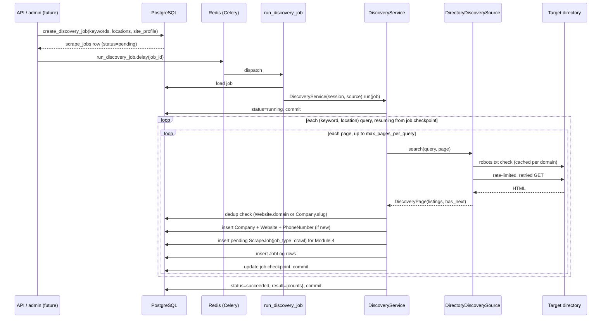

# Module 3 — Company Discovery

**Status:** Implemented — engine, orchestrator, Celery task, and tests are in this PR.
**Depends on:** [Module 1 — Architecture](../architecture/01-architecture.md) (`worker` service, Celery queues) and [Module 2 — Database](02-database.md) (`companies`, `websites`, `phone_numbers`, `scrape_jobs`, `logs`).

## What's in this module

- `apps/worker` — new Celery app. Queues match the Module 1 architecture doc (`discovery`, `crawl`, `extraction`, `enrichment`, `dedup`, `geo`, `scoring`, `indexing`, `scheduled`); only `discovery` has a task today.
- `apps/worker/src/worker/discovery/` — the discovery engine:
  - `models.py` — plain DTOs (`SearchQuery`, `DiscoveredListing`, `DiscoveryPage`) a source returns. No DB knowledge.
  - `site_profiles.py` — declarative per-directory config (`SiteProfile`): CSS selectors + search URL template. One engine, many sites, via config not code.
  - `sources.py` — `DiscoverySource` protocol + `DirectoryDiscoverySource`, the one real implementation: async HTTP (httpx) + HTML parsing (selectolax), with robots.txt compliance and rate limiting applied to every request.
  - `robots.py` — per-domain cached robots.txt compliance (RFC 9309 conventions).
  - `ratelimit.py` — per-domain async token-bucket rate limiter.
  - `retry.py` — bounded exponential-backoff retry for transient HTTP failures (429/5xx/timeouts); 4xx fails fast.
  - `normalize.py` — domain/slug/India-phone normalization used for dedup.
  - `jobs.py` — creates the `scrape_jobs` row a discovery run is driven by.
  - `service.py` — `DiscoveryService`: the orchestrator. Runs the keyword × location query grid, paginates, dedupes, persists, checkpoints, logs.
- `apps/worker/src/worker/tasks/discovery.py` — the Celery task wrapping `DiscoveryService` for real dispatch/retry via Redis.
- `packages/core/src/corelib/db.py` — small refactor: the async engine/session-factory helpers used to live only in `apps/api`; now shared so `apps/worker` doesn't duplicate them.
- Tests: unit (parsing against local fixture HTML via `httpx.MockTransport`, rate limiter timing, normalization) and integration (full `DiscoveryService` runs against real Postgres, covering pagination, cross-query dedup, resume, and partial-failure tolerance).

## How a discovery run works

### Keyword & location discovery

A run is defined by `keywords: list[str]` and `locations: list[str]`; the service runs their full Cartesian product as independent queries (`SearchQuery(keyword, location)`), so "broker" × ["Kothrud", "Baner", "Koregaon Park"] naturally gives locality-level coverage where a directory supports it, without needing a separate "location discovery" code path — location is just another query axis.

### Pagination

Each query pages through `DirectoryDiscoverySource.search(query, page)` until the parsed page reports no next-page link (`SiteProfile.next_page_selector` absent) or `max_pages_per_query` (default 20, set per job) is hit — a safety cap against a misbehaving or unexpectedly infinite pagination selector.

### Rate limiting & robots.txt

Every fetch goes through `DomainRateLimiter` (one token bucket per domain, default configurable via `discovery_default_requests_per_second`, override per `SiteProfile.requests_per_second`) and `RobotsCache` (one robots.txt fetch per domain per run, cached). A confirmed-missing robots.txt (4xx) is treated as "no restrictions published"; a fetch failure or 5xx is treated conservatively as full-disallow rather than assumed permissive — see `robots.py`'s docstring for the RFC 9309 reasoning. Both are applied inside `DirectoryDiscoverySource`, not bolted on by the orchestrator, so no future `DiscoverySource` implementation can accidentally skip them.

### Retry

`retry.py` retries `429`/`5xx`/timeouts/transport errors with exponential backoff up to `discovery_max_retries` (default 3); a `4xx` other than `429` raises immediately (`NonRetryableHTTPError`) since retrying won't help. At the Celery layer, `run_discovery_job` also auto-retries on `ConnectionError`/`OSError` (infra-level failures, e.g. a DB blip) — deliberately narrow, not a blanket `Exception` retry, since `DiscoveryService` already persists a `FAILED` job status and re-raises for anything else, and masking arbitrary exceptions with silent retries would hide real bugs.

### Deduplication (in this module's scope)

Full fuzzy/cross-field duplicate detection is Module 8. This module only needs "have I already saved this exact listing," answered cheaply:
- If the listing has a website, normalize its domain and check `websites.domain` — an exact match means skip.
- If it has no website, fall back to an exact match on `slugify(name)` against `companies.slug` — a conservative heuristic (two genuinely different companies could share a slugified name) that's an accepted, documented limitation until Module 8.

### Resume

Every discovery `scrape_jobs` row carries a `checkpoint: {"query_index": int, "next_page": int}`, updated and **committed** after every single page (not batched at the end) — this is what makes resume real rather than aspirational: a crash mid-run loses at most the in-flight page, never previously completed pages. `run_discovery_job(job_id)` is safe to re-invoke with the same `job_id` after any failure; `DiscoveryService.run()` reads the checkpoint and continues from exactly there. Verified in `test_resume_does_not_refetch_completed_queries`, which asserts (via a call-logging mock transport) that already-completed pages are never re-fetched on resume.

### Logging

Every discovered company, every skipped duplicate, and every per-query failure writes a `logs` row (`JobLog`, FK'd to the `scrape_jobs` row) in addition to a Python `logging` call — so a run's full story is queryable from the database (for a future admin UI) without needing to grep worker stdout.

### What gets saved

Per new listing: a `companies` row (`status=discovered`, `discovered_at` set, `description` seeded from the directory's snippet if present), a `websites` row if a URL was found, a `phone_numbers` row if a phone was found (normalized via `normalize_india_phone`; the raw string is always kept in `raw_value` even when normalization fails), and — this is the hand-off to Module 4 — a **pending** `scrape_jobs` row with `job_type=crawl`. Module 3 does not enqueue a Celery crawl task (that task doesn't exist yet); it leaves a durable to-do in the job ledger, consistent with the DB-first resumability design in Module 1 §4.2. Module 4 will add the Celery task that consumes these pending rows.

## Adding a real target directory

`EXAMPLE_PROFILE` in `site_profiles.py` is a template, not a verified scraper for any live site — this sandbox has no outbound network access to third-party sites (search engines, business directories) to inspect and calibrate real selectors against. To point the engine at a real directory:

1. Inspect that site's actual current search-results HTML and confirm its robots.txt and terms of service permit automated access at the rate you intend to run.
2. Write a `SiteProfile` with the real `search_url_template` and CSS selectors, add it to `SITE_PROFILES`.
3. Treat it as needing periodic revalidation — directory markup drifts over time regardless of who wrote the selectors, same as any scraper.

## Testing

- **Unit** (`tests/unit/`): `test_sources.py` proves the fetch → robots-check → parse → paginate pipeline against hand-written local fixture HTML (`tests/fixtures/example_directory_page{1,2}.html`) via `httpx.MockTransport` — no real network, no flakiness tied to a live site's current markup. `test_normalize.py`, `test_ratelimit.py`, `test_celery_app.py` cover the supporting pieces directly.
- **Integration** (`tests/integration/`): `test_discovery_service.py` runs full `DiscoveryService.run()` calls against real Postgres (same rationale as Module 2 — citext/pg_trgm/etc. aren't sqlite-compatible), covering: job creation, multi-query pagination + persistence, cross-query domain-based dedup, resume-skips-completed-pages, and per-query-failure-doesn't-fail-the-job. Session isolation uses SQLAlchemy's `join_transaction_mode="create_savepoint"` pattern (see `conftest.py`) because `DiscoveryService` calls `session.commit()` mid-run by design (checkpoints must survive a crash) — a plain rollback-after-test wouldn't clean up, so the whole test runs inside an outer transaction whose inner commits only release savepoints.
- **Manual end-to-end**: validated against a real Redis broker and a real `celery worker` subprocess consuming the `discovery` queue (not part of the automated suite, since it needs a running worker process) — a job was created, dispatched via `.delay()`, picked up, executed by `DiscoveryService` against a genuinely unreachable test domain, and correctly recorded the failure as a non-fatal per-query error while the job itself completed as `succeeded`. This also caught a real bug (next section).

## Bug found & fixed during this module

`Celery.autodiscover_tasks(["worker.tasks"])` looks for a `<package>.tasks` submodule per package name given — since `worker.tasks` *is* the tasks package in this layout (not a package containing a `tasks.py`), it was silently trying to import `worker.tasks.tasks`, which doesn't exist, and registering **zero** tasks. A real `celery worker` startup showed an empty `[tasks]` list, which is how this was caught — it would not have been caught by a unit test that only imports `worker.tasks.discovery` directly. Fixed by having `worker/tasks/__init__.py` explicitly import each task module and having `celery_app.py` `import worker.tasks` directly instead of relying on autodiscovery; `test_celery_app.py` now asserts the task is registered so this can't silently regress.

Also worth noting: `job.started_at`/`job.finished_at` were initially set via `server_default`-style `func.now()` assigned as a Python attribute value. That's correct for column *defaults* but wrong for updating an already-loaded ORM object's attribute in a session with `expire_on_commit=False` — the attribute would hold the unevaluated SQL expression in memory rather than a real `datetime` after commit. Switched to `datetime.now(UTC)` for these in-process attribute assignments.

## Recommendations / open questions

1. **RERA agent lists as a discovery source, not just enrichment.** Module 7 (Public RERA Enrichment) matches *already-discovered* companies against RERA records. The RERA registry is itself a public directory of real estate agents and could be a `SiteProfile` source for Module 3 too, potentially a higher-precision one than general web directories. Worth revisiting when Module 7 is built.
2. **`max_pages_per_query` default (20) and default rate (0.5 req/s)** are conservative placeholders; real values should be tuned per target site once one is configured, balancing coverage against politeness.
3. **No admin/API surface yet** to trigger a discovery run — `create_discovery_job` is a plain importable function specifically so a future FastAPI endpoint (Module 11, or an earlier admin utility) can call it directly without pulling in Celery/HTTP dependencies. Not built now since no API module exists yet to host it.
